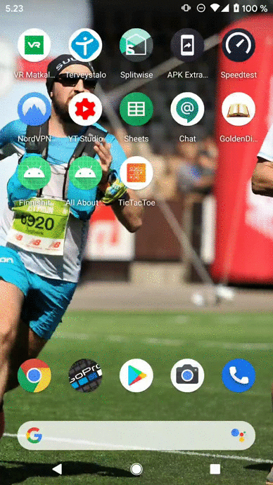
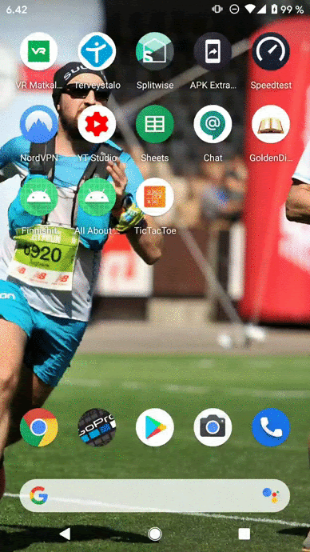
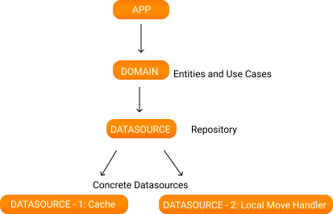

<h1 align="center">Welcome to Clean Tic Tac Toe 👋</h1>

  
  

The target is to create a simple version of the world-famous game Tic Tac. The game is local only, meaning no network connectivity is needed.

If the user closes the app during the game, user can resume the game the next time she launches the app.

The game result can be win/lost/draw.

This app could have been done in a shorter time, but in this codebase you can see an architecture which enables testable, easy to maintain, and extendable code. Each module in this architecture has its own concern. Separating the concerns with dependency injection enables writing unit tests easily. In this project domain, datasource, and local move handler modules are covered with unit tests. Since this project was implemented in such a shot time, I had to compromise from writing unit tests for the cache module and ui tests due to lack of time. Also cache module should use [Jetpack DataStore](https://medium.com/@jurajkunier/migrating-sharedpreferences-to-jetpack-datastore-9deb8259063) to save the data locally instead of saving JSONs to shared preferences.

**App Module:**
The UI and the presenter code lives here. I used MVVM pattern because it works perfectly with Android Jetpack libraries. User interacts with the UI and the view model invokes the interactors (Use Cases) in the domain module.

**Domain Module:**
This module is the core of the project and holds the business logic of the app. The entities and use cases are defined here.

`Coordinate` represents a box in a 3x3 matrix. Rows and columns take values between 0 and 2.
`Game status` is the parent class of the states during the game. There are 5 possible states: `Not Started`, `PlayerWon`, `PlayerLost`, `Draw`, and `In Progress`. The player won and lost states hold the 3 winning coordinates so that it is easy to show the winning combination when the game ends. The `In Progress` status holds the player and computer moves which are the coordinates that player and the computer has played until the moment the game status is requested.
`Statistics` is self explanatory. It holds total wins, loses, and draws.

There are 5 use cases (interactors) in total to be called due to user interactions
- GetGameStatusUseCase -> fetches the current game status from datasource
- GetStatisticsUseCase -> fetches the game statistics from datasource
- HandlePlayerMoveUseCase -> returns the game status after player makes his/her move
- ResetStatisticsUseCase -> user can reset the win, lose and draw statistics
- SaveGameStatusUseCase -> this use enables to continue the game after user closes and re-opens the app
- The domain module has contracts with the datasource module through the repository interfaces.

**Data Source Module**
Data source is the source of data. The source of data can be databases, remote servers, wearable devices etc.

- The Datasource module implements the concrete Repository classes based on the repository interfaces in the domain module.
- The Datasource module also holds the contracts with the concrete implementation of the data sources.

Datasource module orchestrates the data flow between data sources in a repository pattern based on the contracts (interfaces). This module has no idea about concrete implementation of the datasources.

**Local Move Handler Module**
This module is the concrete implementation based on the contract with the datasource module. The responsibility of this class is determining the game status based on player and computer moves. Note that this architecture enables us to add different data sources with the same concern. For example, in the future if the developer decides to use a remote server based on AI for calculations to determine the game status, it would be very easy to integrate it based on the contract. Thanks to separation of concerns, the rest of our codebase won't be affected by this change as long as the new implementation also follows the simple contract with the datasource module which is returning the new game status based on player's move.

**Cache Module**
The responsibility of this data source is caching the game status and game statistics locally. For now, this module first generates a JSON text from the game status and statistics and saves the texts in local files. When the data is fetched from these files, the data is re-generated from a Json string using Kotlin Json library. Thanks to the clean architecture, extending our app is easier. Let's say that we decided to have user login and allow multiple user profiles. Then we will definitely need a database table for storing our data locally. Because the concern of saving data locally is encapsulated in this module, the rest of our app is safe from the changes due to migrating from saving in file to saving in database.

## Author

👤 **Cagatay Ulusoy**

* Twitter: [@ulusoyapps](https://twitter.com/ulusoyapps)
* Github: [@ulusoyca](https://github.com/ulusoyca)
* LinkedIn: [@https:\/\/www.linkedin.com\/in\/cagatayulusoy\/](https://linkedin.com/in/https:\/\/www.linkedin.com\/in\/cagatayulusoy\/)

## Show your support

Give a ⭐️ if this project helped you!

## 📝 License

Copyright © 2020 [Cagatay Ulusoy](https://github.com/ulusoyca). 
This project is [APACHE LICENSE, VERSION 2.0](http://www.apache.org/licenses/LICENSE-2.0) licensed.

***
_This README was generated with ❤️ by [readme-md-generator](https://github.com/kefranabg/readme-md-generator)_